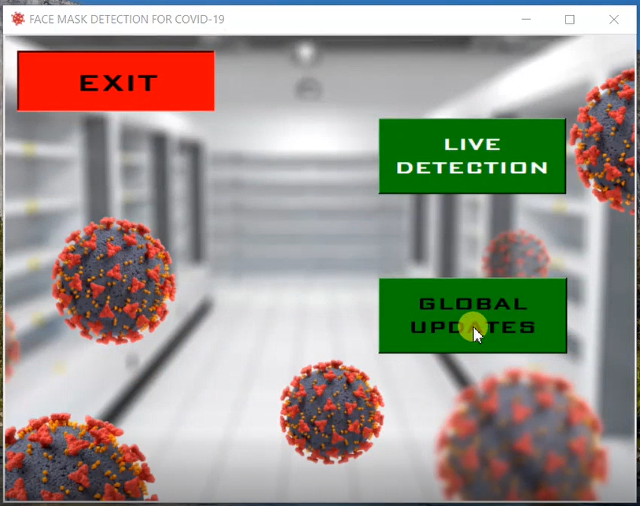
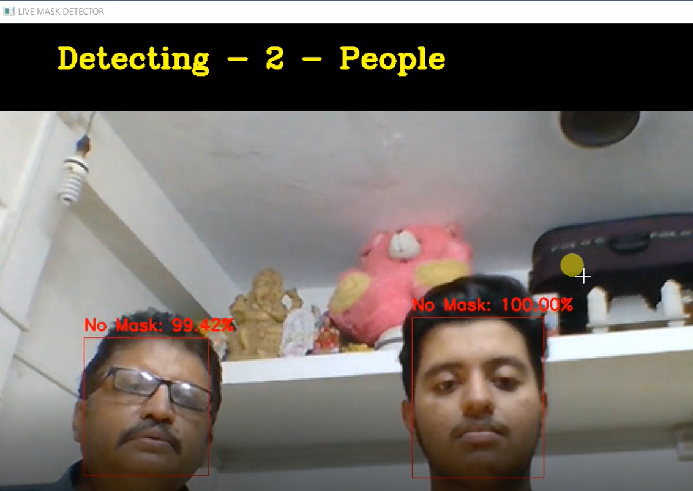
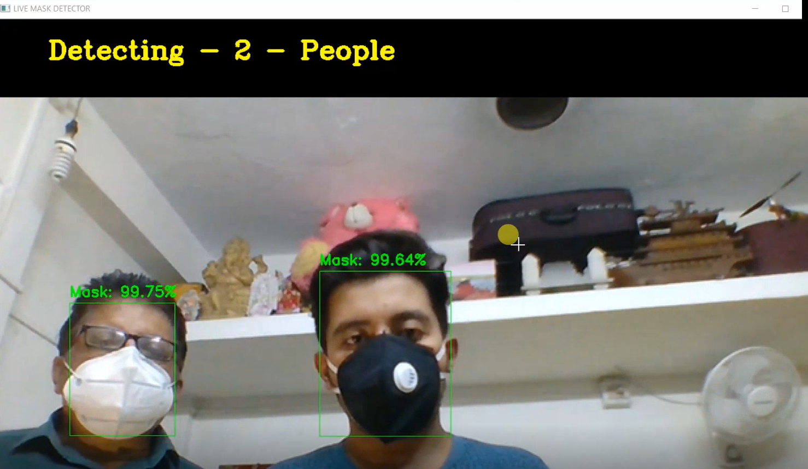
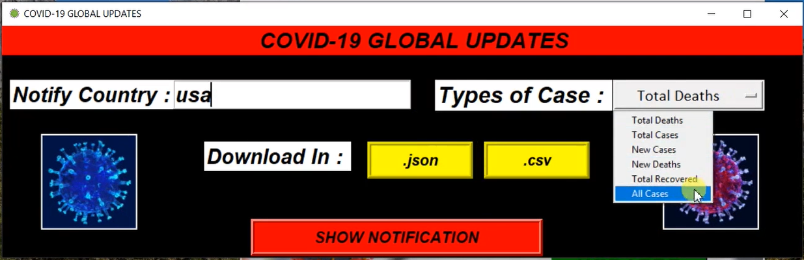
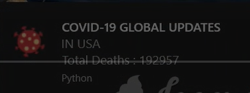
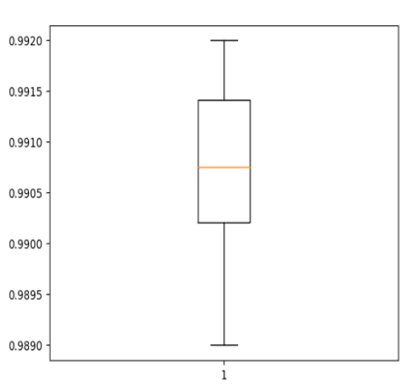
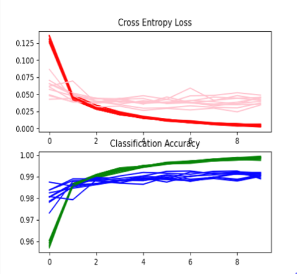
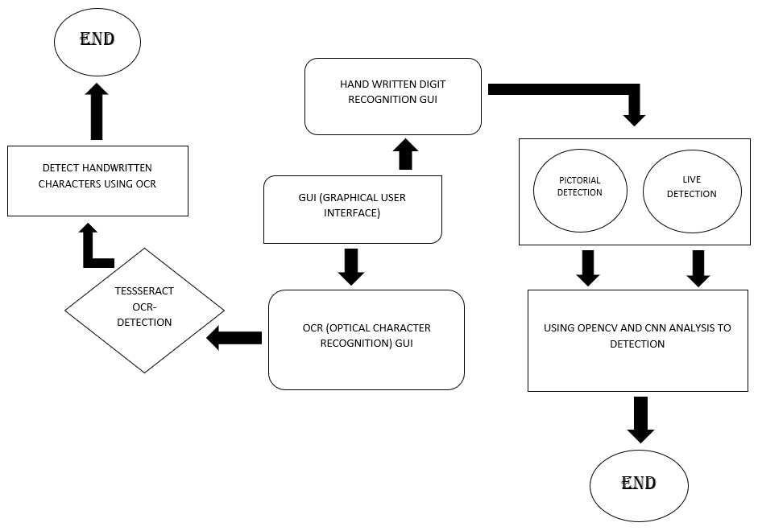
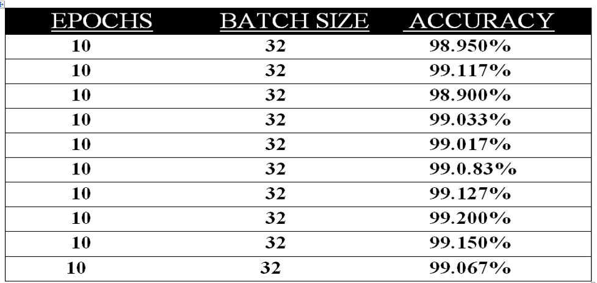

***This new Mask Detection System along with Covid Updates using Python is created by Ankita Sikder and also other group members special credit goes to Biswarup Bhattacharjee(@biswa2210), student of BTECH, in University of Engineering and Management, Kolkata.***

**Email Id: ankita.sikder14@gmail.com.** 

**Contact No: 8583939774.** 


<p align="left">
<a href="https://facebook.com/ankita.sikder.104" target="blank"></a>
<a href="https://instagram.com/ankita.sikder14" target="blank"></a>
<a href="https://github.com/biswa2210/ankitasikder" target="blank"></a>
</p>.

# PROJECT-3-UEMK-MASK-DETECTION-COVID-UPDATES :computer: 

[](https://shields.io/) [](https://shields.io/) [](https://shields.io/) [](https://shields.io/) [](https://shields.io/) [](https://shields.io/) [](https://shields.io/) [](https://shields.io/) [](https://shields.io/) [](https://shields.io/) [](https://shields.io/) [](https://shields.io/)


## About :point_down: 

<div align="justified">
   
This is basically a group project for Project-3 in UEMK. I have contributed some parts of it. This is a ‘Mask Detection System’ based on real world AI and ML applications. The software detects if people are wearing masks or not. It also has a global notification section of covid cases throughout the world. This software is made with Python. Some modules are Tkinter, Pillow, Beautifulsoup, Plyer, Opencv, Pandas, Requests, Itertools etc. We can clearly get an idea that the person is wearing mask or not. In the ‘Global Updates’ part we have to write the name of the country. We can select type of cases related Covid-19 like total deaths, total cases, new cases, new deaths, total recovered, all cases. Then we have to click on the show notification part to see the result. There is a GUI canvas which contains background image changing with time. There are three buttons for different functions. The title of the first button is ‘LIVE DETECTION’. Opening it we get a computer vision using web camera and a bounding rect locating the area. Coming in front of webcam we can see the result. The system detects if we are wearing masks or not. It shows accuracy percentage as per prediction and also the number of people before webcam. The system has been cross checked many times with similar things with mask but in each case, we get 99% correct result. To exit the live detection function we have to press ‘q’ on our keyboard. The next button in the main GUI is ‘COVID UPDATES’. By clicking on this we get a window where we have to write country name and type of covid case. We can select type of cases related Covid-19 like total deaths, total cases, new cases, new deaths, total recovered, all cases. Then we can to click on the show notification button to get a notification pop up in pc. We can also download json or csv format files as record. We have fetched the global updates from worldometer website.

</div>


## Why I have made this project :point_down:

<div align="justified">
   
AI and ML are innovative technology which is useful in present Covid-19 situation. Face mask detection is an AI and computer vision driven image analytic solution which uses visible stream from the camera to detect and generate an alert for people not wearing face masks. This project can be integrated with embedded systems for application in schools, airports, railway stations, offices and public places to ensure that public safety guidelines are followed. This project also contains a section to get global notification related to Covid-19 affected people as per our chosen country. Not only for Covid-19 cases but also for other regular cases this program is useful to deploy. Finally, this project is user-friendly, safe and useful in real life practice in each and every type of sector including offices, health care centre etc.

</div>

## Applications and Future Scopes :point_down:


<div align="justified">

In the ‘Live Detection’ part we can place our face before web-cam of our pc and then it will detect that we are wearing mask or not. The number of people will be shown. More than one person can be detected. The prediction accuracy of with mask or without mask will be shown. We can clearly get an idea that the person is wearing mask or not. So, in this global Covid-19 pandemic situation this system can be used for safety measures. This system can be used in offices, schools, colleges, railway station, airport, hospitals, shopping malls and any other places to check that people are wearing masks or not. The notification system can be also used anywhere for database analysis of Covid Cases. Students, researchers, officers or anyone can use this for database and research purpose. This will also help for statistical analysis of records. Many important exams which are getting postponed affecting students’ careers. In future using this system many exams and other important tasks can be conducted avoiding any losses. This system will make people follow the guidelines related Covid-19 and it will also make the situation better by decreasing the number of affected people. The global notification idea can be added in other systems and shown in public places through tv or computer to keep people updated and make them alert for their health.

</div>


## Folder Structure :point_down:

```bash
PROJECT-3
     ├── .idea
     ├── _pycache_  
     ├── dataset
     |      ├── with_mask
     |      └── without_mask
     ├── face_detector
     ├── CoronaGlobalUpdatesGUI.py
     ├── CovidUpdates.py
     ├── Detection.py
     ├── Training.py
     ├── mask_detection_gui.py
     └── mask_detector.model

```                       

**:point_right: [click here to read Project3 Report](https://drive.google.com/file/d/15IqOM4K8SBVxaGbtE5LOFEmiupTEAu7G/view)<br>
:point_right: [click here to see Project3 PowerPoint Presentation](https://drive.google.com/file/d/1qD7uEHKcKbqrytWh7flyq1IBfE8Tqfiz/view)<br>
:point_right: [click here to view or download Project3 Demo Video](https://drive.google.com/file/d/1cgKl4oKrcXPUbekuUhQ1fua2md3TFTG_/view)**

## Making :point_down:

<div align="justified">
   
dataset-->Here we use a external dataset for training our DEEP LEARNING model.IN OUR DATA SET TOTAL TWO FOLDERS ARE PRESENT FIRST ONE CO`NTAINS 1915 IMAGES OF PEOPLE WITH MASK AND 1918 IMAGES OF PEOPLE WITHOUT MASK.AFTER SELECTION OUR DATASET WE CHOOSE BEST EPOCH , LEARNING RATE AND BATCH SIZE TO DECREASE LOSS FUNCTION AND INCREASING ACCURACY OF OUR MODEL.<br>
model training-->Model training in machine language is the process of feeding an ML algorithm with data to help identify and learn good values for all attributes involved. There are several types of machine learning models, of which the most common ones are supervised and unsupervised learning. Training a model simply means learning (determining) good values for all the weights and the bias from labeled examples. In supervised learning, a machine learning algorithm builds a model by examining many examples and attempting to find a model that minimizes loss; this process is called empirical risk minimization. Today, ML algorithms are trained using three prominent methods. These are three types of machine learning: supervised learning, unsupervised learning, and reinforcement learning.<br>
model structure-->Here we create two models , at first we create head model , then we create base model . After create head model it will place top of the base model . Use MobilenetV2 to create base model . In Head model first add Average Pooling with pool size (7,7),after add Flatten layer, Dense layer with softmax activation function . Here we  use adam optimizer that involves a combination of two gradient descent methodologies: Momentum: This algorithm is used to accelerate the gradient descent algorithm by taking into consideration the 'exponentially weighted average' of the gradients.<br>
live detection-->Our project 'MASK DETECTION SYSTEM' uses computer vision through opencv module to live detect faces with mask or without mask. We have to place our face in bouding rect and then we can see the prediction accuracy percentage of wearing or not wearing mask. More than one people's face can be detected and we can also see the number of faces using puttext. Finally we get a clear result if we are wearing masks or not.<br>
deep learning-->At first we create a deep learning part of our project using a external dataset with mask and without mask images. We create a  head model using CNN algorithm using mobilenetv2.After it is placed on the top of base model.<br>
exit function-->But if you want to run some infinite loop and you don't want to destroy your Tk window and want to execute some code after root.mainloop() line then you should use root.quit().
notification feature-->The fortunate feature of notification systems is that it simplifies communication by alerting all employees about emergencies through various communication channels. This process occurs within a matter of seconds from the time the message is sent. We use  plyer for sent covid updates notifications.<br>
download csv and json-->JSON stands for JavaScript Object Notation. CSV stands for Comma separated value. It is used as the syntax for storing and exchanging the data. It is a plain text format with a series of values separated by commas . Use pandas and beautifulsoup to download csv or json file as per choice.<br>
gui integration-->To allow higher productivity, while facilitating a lower cognitive load, says About.com. Graphical user interfaces allow users to interact with computers using a mouse and other input tools . Here we use tkinter to create our efficient gui.<br>
We have created total 5 python files. Training.py, Detection.py, mask_detection_gui.py, CoronaGlobalUpdatesGUI.py and CovidUpdates.py.

</div>

## Screenshots :point_down: 

<div align="center">
 
<a href="images/mask1.PNG"></a> <a href="images/mask6.PNG"></a>

<a href="images/mask2.PNG"></a> <a href="images/mask3.PNG"></a>

<a href="images/mask4.PNG"></a> <a href="images/mask5.PNG"></a>
</div>

## Diagrams :point_down:

<div align="center">

<a href="images/box.png"></a> <a href="images/graph.png"></a>
 
<a href="images/arc.PNG"></a> 
 
 <a href="images/table.PNG"></a>
 
</div>

